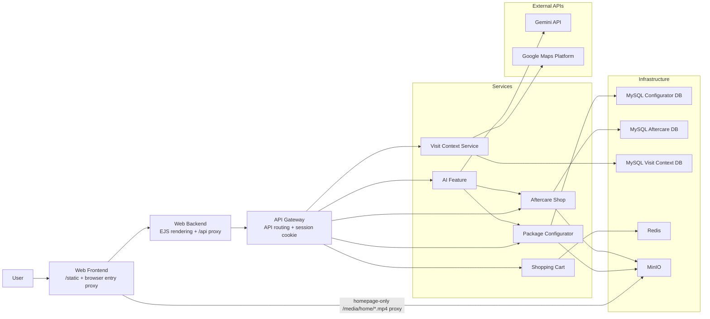

# Wellness Center Runtime Architecture

The browser only reaches domain data through the frontend, backend, and gateway chain. Domain services own their storage, and cross-service reads happen through HTTP APIs.

## Browser Media Boundary

Browser-visible media has three allowed paths:

- Presentation images use `/static/images/*` and are served by `web-frontend` from `web/public/images`.
- The homepage presentation video exception uses `/media/home/*.mp4`; this path is only for homepage MP4 presentation videos and must not become a generic MinIO bucket proxy.
- Package and aftercare business media use `/api/*/assets/*` and remain behind the owning-service API boundary. Center media is not currently browser-exposed; if exposed later, it must also stay behind an owning-service API boundary.

MinIO is never exposed directly to the browser. Browser-visible business media requests must flow through `web-frontend -> web-backend -> api-gateway -> owning service -> MinIO`. The only browser-visible MinIO shortcut is the narrowly scoped `web-frontend` proxy for `/media/home/*.mp4` homepage presentation videos.
