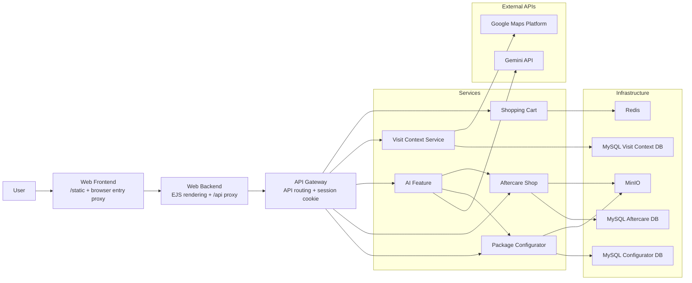

# Wellness Center Initialization Implementation Plan

> **For agentic workers:** REQUIRED SUB-SKILL: Use superpowers:subagent-driven-development (recommended) or superpowers:executing-plans to implement this plan task-by-task. Steps use checkbox (`- [ ]`) syntax for tracking.

**Goal:** Initialize `D:\CodeSpace\dbe-cloud-soloproject` as a complete Wellness Center course project that preserves the group project's frontend -> backend -> gateway -> services -> infrastructure architecture.

**Architecture:** Reuse the working architecture from `D:\CodeSpace\dbe-cloud-groupproject` and retheme it into a Wellness Center application. Keep the same deployment shape, proxy boundaries, service-owned MySQL pattern, Redis cart behavior, MinIO asset flow, EJS rendering style, and smoke-test discipline.

**Tech Stack:** Node.js, Express, EJS, Docker Compose, MySQL 8.4, Redis 8, MinIO, Gemini via `@google/genai`, Google Maps Platform, PowerShell smoke tests.

---

## Scope Notes

This plan intentionally covers the full initialization because the P0 requirement is architecture compliance across the entire running stack. The services are not independent deliverables: the project is only valid when the browser, web backend, gateway, domain services, MySQL, Redis, MinIO, and smoke tests work together.

The plan should be executed in small commits.

## File Structure Map

Create and maintain this structure:

```text
D:\CodeSpace\dbe-cloud-soloproject\
├─ api-gateway\
│  ├─ src\server.js
│  ├─ test\asset-proxy.test.js
│  ├─ test\visit-context-proxy.test.js
│  ├─ Dockerfile
│  ├─ package.json
│  └─ package-lock.json
├─ assets\
│  ├─ package-configurator\
│  ├─ aftercare-shop\
│  └─ center\
├─ docs\
│  ├─ architecture.md
│  ├─ architecture.mmd
│  ├─ project-status.md
│  └─ superpowers\
├─ infrastructure\
│  ├─ mysql\init\01_aftercare_shop.sql
│  ├─ mysql\init\02_package_configurator.sql
│  ├─ mysql\init\03_visit_context.sql
│  └─ mysql\seed-service.sh
├─ scripts\
│  ├─ smoke-test.ps1
│  └─ sync-minio-images.sh
├─ services\
│  ├─ web-frontend\
│  ├─ web-backend\
│  ├─ package-configurator\
│  ├─ aftercare-shop\
│  ├─ ai-feature\
│  ├─ visit-context-service\
│  └─ shopping-cart\
├─ web\
│  ├─ public\
│  └─ views\
├─ .dockerignore
├─ .env.example
├─ .gitattributes
├─ .gitignore
├─ docker-compose.yml
└─ README.md
```

Responsibilities:

- `api-gateway/src/server.js`: same-origin API boundary, session cookie, JSON proxying, binary asset proxying.
- `services/web-frontend/src/server.js`: host-facing static server and request proxy to `web-backend`.
- `services/web-backend/src/server.js`: EJS page routes and `/api/*` forwarding to `api-gateway`.
- `services/package-configurator/src/server.js`: package option data, valid combinations, price calculation, package asset streaming.
- `services/aftercare-shop/src/server.js`: aftercare product list/detail and product asset streaming.
- `services/ai-feature/src/server.js`: consultation recommendation endpoint and Gemini integration guard.
- `services/visit-context-service/src/server.js`: center locations, weather/visit context, visit-context assets.
- `services/shopping-cart/src/*`: Redis-backed anonymous cart.
- `infrastructure/mysql/init/*.sql`: deterministic seed data for DB-backed services.
- `scripts/smoke-test.ps1`: Windows-friendly full-stack validation.

---

### Task 1: Prepare The Architecture Skeleton

**Files:**
- Reference only: `D:\CodeSpace\dbe-cloud-groupproject`
- Create/modify selectively: root runtime/config files copied from the group project when needed
- Create/modify: `api-gateway/**`
- Create/modify: `assets/**`
- Create/modify: `infrastructure/**`
- Create/modify: `scripts/**`
- Create/modify: `services/**`
- Create/modify: `web/**`
- Do not copy: group `docs/**`, `exchange/**`, `CLAUDE.md`, or historical project documentation
- Preserve: `docs/top-level-knowledge/project-context.md`
- Preserve: `docs/top-level-knowledge/tech-stack.md`
- Preserve: `docs/impl-plans/2026-05-28-wellness-center-initialization-design.md`
- Preserve: `docs/impl-plans/2026-05-28-wellness-center-initialization.md`

- [ ] **Step 1: Inspect the current solo worktree**

Run:

```powershell
git status --short
Get-ChildItem -Force | Select-Object Mode,Length,Name
```

Expected:

```text
Existing tracked docs may be modified. Do not discard or overwrite them.
```

The group project is a reference source, not a whole-repository copy source.

- [ ] **Step 2: Copy only reusable runtime folders and config files**

Run this from `D:\CodeSpace\dbe-cloud-soloproject`:

```powershell
$source = 'D:\CodeSpace\dbe-cloud-groupproject'
$target = 'D:\CodeSpace\dbe-cloud-soloproject'
$runtimeDirectories = @('api-gateway', 'assets', 'infrastructure', 'scripts', 'services', 'web')
$runtimeFiles = @('.dockerignore', '.env.example', '.gitattributes', 'docker-compose.yml')

foreach ($name in $runtimeDirectories) {
  $sourceDirectory = Join-Path $source $name
  $targetDirectory = Join-Path $target $name
  New-Item -ItemType Directory -Path $targetDirectory -Force | Out-Null
  Get-ChildItem -LiteralPath $sourceDirectory -Force |
    Copy-Item -Destination $targetDirectory -Recurse -Force
}

foreach ($name in $runtimeFiles) {
  Copy-Item -LiteralPath (Join-Path $source $name) -Destination (Join-Path $target $name) -Force
}
```

Expected:

```text
api-gateway, assets, infrastructure, scripts, services, web, docker-compose.yml, .dockerignore, .env.example, and .gitattributes exist in the solo project.
Group docs, exchange notes, CLAUDE.md, historical README content, and other project-history files are not copied.
```

- [ ] **Step 3: Verify durable solo docs were not overwritten**

Run:

```powershell
Test-Path docs\top-level-knowledge\project-context.md
Test-Path docs\top-level-knowledge\tech-stack.md
Test-Path docs\impl-plans\2026-05-28-wellness-center-initialization-design.md
Test-Path docs\impl-plans\2026-05-28-wellness-center-initialization.md
Test-Path docs\docs
Test-Path CLAUDE.md
```

Expected:

```text
True
True
True
True
False
False
```

Do not run `git checkout -- docs/...` here. The approved solo docs are the source of truth and may contain intentional uncommitted edits.

Verify the staged/candidate tree does not contain copied group history:

```powershell
git status --short
```

Expected:

```text
No copied group documentation such as docs/PRD.md, docs/team-collaboration-breakdown.md, docs/docs/**, exchange/**, or CLAUDE.md appears.
```

- [ ] **Step 4: Remove copied dependency directories**

Run:

```powershell
Get-ChildItem -Path api-gateway,services -Recurse -Directory -Force |
  Where-Object { $_.Name -eq 'node_modules' } |
  ForEach-Object {
    $resolved = Resolve-Path -LiteralPath $_.FullName
    if ($resolved.Path -notlike 'D:\CodeSpace\dbe-cloud-soloproject\*') {
      throw "Refusing to delete outside solo project: $($resolved.Path)"
    }
    Remove-Item -LiteralPath $resolved.Path -Recurse -Force
  }
```

Expected:

```text
No node_modules directories remain under api-gateway or services.
```

Verify:

```powershell
Get-ChildItem -Path api-gateway,services -Recurse -Directory -Force |
  Where-Object { $_.Name -eq 'node_modules' }
```

Expected: no output.

- [ ] **Step 5: Rename service directories**

Run:

```powershell
Rename-Item -LiteralPath 'services\web-shop-frontend' -NewName 'web-frontend'
Rename-Item -LiteralPath 'services\web-shop-backend' -NewName 'web-backend'
Rename-Item -LiteralPath 'services\car-configurator' -NewName 'package-configurator'
Rename-Item -LiteralPath 'services\merch-shop' -NewName 'aftercare-shop'
Rename-Item -LiteralPath 'services\route-service' -NewName 'visit-context-service'
```

Expected:

```text
services\web-frontend
services\web-backend
services\package-configurator
services\aftercare-shop
services\visit-context-service
services\ai-feature
services\shopping-cart
```

- [ ] **Step 6: Commit the skeleton copy**

Run:

```powershell
git add api-gateway assets infrastructure scripts services web .dockerignore .env.example .gitattributes docker-compose.yml
git commit -m "chore: copy wellness center architecture skeleton"
```

Expected:

```text
[main <hash>] chore: copy wellness center architecture skeleton
```

---

### Task 2: Retheme Root Configuration And Compose Topology

**Files:**
- Modify: `.env.example`
- Modify: `.dockerignore`
- Modify: `.gitignore`
- Modify: `docker-compose.yml`
- Modify: `README.md`
- Modify: `.gitattributes`

- [ ] **Step 1: Update `.gitignore`**

Ensure `.gitignore` contains:

```gitignore
.env
node_modules/
infrastructure/minio/data/
.superpowers/
```

Run:

```powershell
Get-Content .gitignore
```

Expected includes all four entries above.

- [ ] **Step 2: Replace `.env.example`**

Replace `.env.example` with:

```dotenv
# Docker Compose reads this file as the variable source, but each service
# declares only the variables it needs in docker-compose.yml.

# Database
MYSQL_PORT=3306
# Schema names are fixed and service-owned:
# - package-configurator uses wellness_package_configurator
# - aftercare-shop uses wellness_aftercare_shop
# - visit-context-service uses wellness_visit_context
DBE_CLOUDDEV_CONFIGURATOR=DBE_CLOUDDEV_CONFIGURATOR
DBE_CLOUDDEV_CONFIGURATOR_PASSWORD=DBE_CLOUDDEV_CONFIGURATOR_PASSWORD
DBE_CLOUDDEV_CONFIGURATOR_ROOT_PASSWORD=DBE_CLOUDDEV_CONFIGURATOR_ROOT_PASSWORD
DBE_CLOUDDEV_AFTERCARE=DBE_CLOUDDEV_AFTERCARE
DBE_CLOUDDEV_AFTERCARE_PASSWORD=DBE_CLOUDDEV_AFTERCARE_PASSWORD
DBE_CLOUDDEV_AFTERCARE_ROOT_PASSWORD=DBE_CLOUDDEV_AFTERCARE_ROOT_PASSWORD
DBE_CLOUDDEV_VISIT_CONTEXT=DBE_CLOUDDEV_VISIT_CONTEXT
DBE_CLOUDDEV_VISIT_CONTEXT_PASSWORD=DBE_CLOUDDEV_VISIT_CONTEXT_PASSWORD
DBE_CLOUDDEV_VISIT_CONTEXT_ROOT_PASSWORD=DBE_CLOUDDEV_VISIT_CONTEXT_ROOT_PASSWORD

# Cache
REDIS_HOST=redis
REDIS_PORT=6379

# Object Storage
MINIO_ENDPOINT=minio
MINIO_PORT=9000
MINIO_ROOT_USER=minio_user
MINIO_ROOT_PASSWORD=change_me
MINIO_BUCKET=wellness-media

# External APIs
GEMINI_API_KEY=replace_me
GEMINI_MODEL=gemini-2.5-flash
GEMINI_FALLBACK_MODEL=gemini-2.5-flash-lite
GOOGLE_MAPS_API_KEY=replace_me
GOOGLE_WEATHER_API_KEY=replace_me
```

- [ ] **Step 3: Replace `docker-compose.yml` service topology**

Edit `docker-compose.yml` so it defines these services and dependency edges:

```yaml
services:
  api-gateway:
    build:
      context: .
      dockerfile: api-gateway/Dockerfile
    expose:
      - "4101"
    environment:
      PORT: 4101
      CONFIGURATOR_URL: http://package-configurator:4103
      AFTERCARE_URL: http://aftercare-shop:4104
      CART_URL: http://shopping-cart:4106
      AI_URL: http://ai-feature:4105
      VISIT_CONTEXT_URL: http://visit-context-service:4107
    depends_on:
      - package-configurator
      - aftercare-shop
      - shopping-cart
      - ai-feature
      - visit-context-service
    volumes:
      - ./api-gateway/src:/app/api-gateway/src

  web-frontend:
    build:
      context: .
      dockerfile: services/web-frontend/Dockerfile
    ports:
      - "4100:4100"
    environment:
      PORT: 4100
      WEB_BACKEND_URL: http://web-backend:4102
    depends_on:
      - web-backend
    volumes:
      - ./web:/app/web

  web-backend:
    build:
      context: .
      dockerfile: services/web-backend/Dockerfile
    expose:
      - "4102"
    environment:
      PORT: 4102
      API_GATEWAY_URL: http://api-gateway:4101
      GOOGLE_MAPS_API_KEY: ${GOOGLE_MAPS_API_KEY}
    depends_on:
      - api-gateway
    volumes:
      - ./web:/app/web

  package-configurator:
    build:
      context: ./services/package-configurator
    expose:
      - "4103"
    environment:
      PORT: 4103
      MYSQL_HOST: mysql-configurator
      MYSQL_PORT: ${MYSQL_PORT}
      MYSQL_USER: ${DBE_CLOUDDEV_CONFIGURATOR}
      MYSQL_PASSWORD: ${DBE_CLOUDDEV_CONFIGURATOR_PASSWORD}
      MINIO_ENDPOINT: ${MINIO_ENDPOINT}
      MINIO_PORT: ${MINIO_PORT}
      MINIO_BUCKET: ${MINIO_BUCKET}
    depends_on:
      mysql-configurator-seed:
        condition: service_completed_successfully

  aftercare-shop:
    build:
      context: ./services/aftercare-shop
    expose:
      - "4104"
    environment:
      PORT: 4104
      MYSQL_HOST: mysql-aftercare
      MYSQL_PORT: ${MYSQL_PORT}
      MYSQL_USER: ${DBE_CLOUDDEV_AFTERCARE}
      MYSQL_PASSWORD: ${DBE_CLOUDDEV_AFTERCARE_PASSWORD}
      MINIO_ENDPOINT: ${MINIO_ENDPOINT}
      MINIO_PORT: ${MINIO_PORT}
      MINIO_BUCKET: ${MINIO_BUCKET}
    depends_on:
      mysql-aftercare-seed:
        condition: service_completed_successfully

  shopping-cart:
    build:
      context: ./services/shopping-cart
    expose:
      - "4106"
    environment:
      PORT: 4106
      REDIS_HOST: ${REDIS_HOST}
      REDIS_PORT: ${REDIS_PORT}
    depends_on:
      - redis

  ai-feature:
    build:
      context: ./services/ai-feature
    expose:
      - "4105"
    environment:
      PORT: 4105
      CONFIGURATOR_URL: http://package-configurator:4103
      AFTERCARE_URL: http://aftercare-shop:4104
      GEMINI_API_KEY: ${GEMINI_API_KEY}
      GEMINI_MODEL: ${GEMINI_MODEL:-gemini-2.5-flash}
      GEMINI_FALLBACK_MODEL: ${GEMINI_FALLBACK_MODEL:-gemini-2.5-flash-lite}
    depends_on:
      - package-configurator
      - aftercare-shop

  visit-context-service:
    build:
      context: ./services/visit-context-service
    expose:
      - "4107"
    environment:
      PORT: 4107
      MYSQL_HOST: mysql-visit-context
      MYSQL_PORT: ${MYSQL_PORT}
      MYSQL_USER: ${DBE_CLOUDDEV_VISIT_CONTEXT}
      MYSQL_PASSWORD: ${DBE_CLOUDDEV_VISIT_CONTEXT_PASSWORD}
      GOOGLE_WEATHER_API_KEY: ${GOOGLE_WEATHER_API_KEY}
    depends_on:
      mysql-visit-context-seed:
        condition: service_completed_successfully

  mysql-configurator:
    image: mysql:8.4
    environment:
      MYSQL_ROOT_PASSWORD: ${DBE_CLOUDDEV_CONFIGURATOR_ROOT_PASSWORD}
    healthcheck:
      test: ["CMD", "mysqladmin", "ping", "-h", "127.0.0.1", "-uroot", "-p${DBE_CLOUDDEV_CONFIGURATOR_ROOT_PASSWORD}"]
      interval: 5s
      timeout: 5s
      retries: 20
      start_period: 10s
    volumes:
      - mysql_configurator_data:/var/lib/mysql

  mysql-configurator-seed:
    image: mysql:8.4
    depends_on:
      mysql-configurator:
        condition: service_healthy
    environment:
      MYSQL_HOST: mysql-configurator
      ROOT_PASSWORD: ${DBE_CLOUDDEV_CONFIGURATOR_ROOT_PASSWORD}
      APP_USER: ${DBE_CLOUDDEV_CONFIGURATOR}
      APP_PASSWORD: ${DBE_CLOUDDEV_CONFIGURATOR_PASSWORD}
      APP_DATABASE: wellness_package_configurator
      SEED_FILE: /seed/02_package_configurator.sql
    volumes:
      - ./infrastructure/mysql/init:/seed:ro
      - ./infrastructure/mysql/seed-service.sh:/seed-service.sh:ro
    entrypoint: ["/bin/sh", "/seed-service.sh"]

  mysql-aftercare:
    image: mysql:8.4
    environment:
      MYSQL_ROOT_PASSWORD: ${DBE_CLOUDDEV_AFTERCARE_ROOT_PASSWORD}
    healthcheck:
      test: ["CMD", "mysqladmin", "ping", "-h", "127.0.0.1", "-uroot", "-p${DBE_CLOUDDEV_AFTERCARE_ROOT_PASSWORD}"]
      interval: 5s
      timeout: 5s
      retries: 20
      start_period: 10s
    volumes:
      - mysql_aftercare_data:/var/lib/mysql

  mysql-aftercare-seed:
    image: mysql:8.4
    depends_on:
      mysql-aftercare:
        condition: service_healthy
    environment:
      MYSQL_HOST: mysql-aftercare
      ROOT_PASSWORD: ${DBE_CLOUDDEV_AFTERCARE_ROOT_PASSWORD}
      APP_USER: ${DBE_CLOUDDEV_AFTERCARE}
      APP_PASSWORD: ${DBE_CLOUDDEV_AFTERCARE_PASSWORD}
      APP_DATABASE: wellness_aftercare_shop
      SEED_FILE: /seed/01_aftercare_shop.sql
    volumes:
      - ./infrastructure/mysql/init:/seed:ro
      - ./infrastructure/mysql/seed-service.sh:/seed-service.sh:ro
    entrypoint: ["/bin/sh", "/seed-service.sh"]

  mysql-visit-context:
    image: mysql:8.4
    environment:
      MYSQL_ROOT_PASSWORD: ${DBE_CLOUDDEV_VISIT_CONTEXT_ROOT_PASSWORD}
    healthcheck:
      test: ["CMD", "mysqladmin", "ping", "-h", "127.0.0.1", "-uroot", "-p${DBE_CLOUDDEV_VISIT_CONTEXT_ROOT_PASSWORD}"]
      interval: 5s
      timeout: 5s
      retries: 20
      start_period: 10s
    volumes:
      - mysql_visit_context_data:/var/lib/mysql

  mysql-visit-context-seed:
    image: mysql:8.4
    depends_on:
      mysql-visit-context:
        condition: service_healthy
    environment:
      MYSQL_HOST: mysql-visit-context
      ROOT_PASSWORD: ${DBE_CLOUDDEV_VISIT_CONTEXT_ROOT_PASSWORD}
      APP_USER: ${DBE_CLOUDDEV_VISIT_CONTEXT}
      APP_PASSWORD: ${DBE_CLOUDDEV_VISIT_CONTEXT_PASSWORD}
      APP_DATABASE: wellness_visit_context
      SEED_FILE: /seed/03_visit_context.sql
    volumes:
      - ./infrastructure/mysql/init:/seed:ro
      - ./infrastructure/mysql/seed-service.sh:/seed-service.sh:ro
    entrypoint: ["/bin/sh", "/seed-service.sh"]

  redis:
    image: redis:8-alpine

  minio:
    image: minio/minio:RELEASE.2025-09-07T16-13-09Z
    command: server /data --console-address ":9001"
    environment:
      MINIO_ROOT_USER: ${MINIO_ROOT_USER}
      MINIO_ROOT_PASSWORD: ${MINIO_ROOT_PASSWORD}
    ports:
      - "9001:9001"
    healthcheck:
      test: ["CMD", "curl", "-f", "http://localhost:9000/minio/health/live"]
      interval: 5s
      timeout: 3s
      retries: 10
      start_period: 5s
    volumes:
      - ./infrastructure/minio/data:/data

  minio-init:
    image: minio/mc:RELEASE.2025-08-13T08-35-41Z
    depends_on:
      minio:
        condition: service_healthy
    volumes:
      - ./assets/package-configurator:/seed/package-configurator:ro
      - ./assets/aftercare-shop:/seed/aftercare-shop:ro
      - ./assets/center:/seed/center:ro
      - ./web/public/images:/seed/home-images:ro
    entrypoint: >
      /bin/sh -c "
      until mc alias set local http://minio:${MINIO_PORT} ${MINIO_ROOT_USER} ${MINIO_ROOT_PASSWORD}; do
        sleep 2;
      done;
      mc mb --ignore-existing local/${MINIO_BUCKET};
      mc anonymous set download local/${MINIO_BUCKET};
      mc mirror --overwrite /seed/package-configurator local/${MINIO_BUCKET}/package-configurator;
      mc mirror --overwrite /seed/aftercare-shop local/${MINIO_BUCKET}/aftercare-shop;
      mc mirror --overwrite /seed/center local/${MINIO_BUCKET}/center;
      mc mirror --overwrite /seed/home-images local/${MINIO_BUCKET}/home;
      echo 'Done.';
      "

volumes:
  mysql_configurator_data:
  mysql_aftercare_data:
  mysql_visit_context_data:
```

- [ ] **Step 4: Validate Compose syntax**

Run:

```powershell
docker compose config --quiet
```

Expected: exit code `0`.

- [ ] **Step 5: Commit root retheme**

Run:

```powershell
git add -- .env.example .dockerignore .gitignore .gitattributes docker-compose.yml README.md
git commit -m "chore: define wellness center compose topology"
```

Expected:

```text
[main <hash>] chore: define wellness center compose topology
```

---

### Task 3: Create Wellness Center Seed Data And Asset Folders

**Files:**
- Delete: `infrastructure/mysql/init/01_merch_shop.sql`
- Delete: `infrastructure/mysql/init/02_car_configurator.sql`
- Delete: `infrastructure/mysql/init/03_route_service.sql`
- Create: `infrastructure/mysql/init/01_aftercare_shop.sql`
- Create: `infrastructure/mysql/init/02_package_configurator.sql`
- Create: `infrastructure/mysql/init/03_visit_context.sql`
- Modify: `infrastructure/mysql/seed-service.sh`
- Create/modify: `assets/package-configurator/*`
- Create/modify: `assets/aftercare-shop/*`
- Create/modify: `assets/center/*`

- [ ] **Step 1: Replace aftercare seed SQL**

Create `infrastructure/mysql/init/01_aftercare_shop.sql`:

```sql
CREATE DATABASE IF NOT EXISTS wellness_aftercare_shop CHARACTER SET utf8mb4 COLLATE utf8mb4_unicode_ci;
USE wellness_aftercare_shop;

SET NAMES utf8mb4;

DROP TABLE IF EXISTS products;

CREATE TABLE products (
  id INT PRIMARY KEY,
  slug VARCHAR(120) NOT NULL UNIQUE,
  name VARCHAR(255) NOT NULL,
  category VARCHAR(120) NOT NULL,
  price DECIMAL(10,2) NOT NULL,
  description VARCHAR(500) NOT NULL,
  usage_note VARCHAR(255),
  minio_object VARCHAR(255) NOT NULL
) CHARACTER SET utf8mb4 COLLATE utf8mb4_unicode_ci;

INSERT INTO products
  (id, slug, name, category, price, description, usage_note, minio_object)
VALUES
  (1, 'heated-neck-wrap', 'Heated Neck Wrap', 'heat-care', 34.90, 'Reusable warm wrap for shoulder and neck relaxation after a massage session.', 'Use at home for short warmth intervals.', 'aftercare-shop/heated-neck-wrap.svg'),
  (2, 'lavender-aroma-oil', 'Lavender Aroma Oil', 'aroma', 18.50, 'A light aroma oil for calming evening routines and relaxation rituals.', 'External use only.', 'aftercare-shop/lavender-aroma-oil.svg'),
  (3, 'recovery-massage-ball', 'Recovery Massage Ball', 'mobility', 12.90, 'Compact massage ball for gentle self-massage of shoulders, feet, and back.', 'Avoid direct pressure on injured areas.', 'aftercare-shop/recovery-massage-ball.svg'),
  (4, 'ergonomic-neck-pillow', 'Ergonomic Neck Pillow', 'comfort', 42.00, 'Supportive pillow for rest after neck and shoulder relief sessions.', 'Choose a comfortable sleeping position.', 'aftercare-shop/ergonomic-neck-pillow.svg'),
  (5, 'herbal-warmth-pack', 'Herbal Warmth Pack', 'heat-care', 26.90, 'Herbal pack designed for cozy warmth and quiet recovery moments.', 'Warm according to product instructions.', 'aftercare-shop/herbal-warmth-pack.svg'),
  (6, 'stretching-band', 'Gentle Stretching Band', 'mobility', 15.90, 'Soft resistance band for guided mobility exercises after a center visit.', 'Use only with comfortable movements.', 'aftercare-shop/stretching-band.svg');
```

- [ ] **Step 2: Replace package configurator seed SQL**

Create `infrastructure/mysql/init/02_package_configurator.sql`:

```sql
CREATE DATABASE IF NOT EXISTS wellness_package_configurator CHARACTER SET utf8mb4 COLLATE utf8mb4_unicode_ci;
USE wellness_package_configurator;

SET NAMES utf8mb4;

DROP TABLE IF EXISTS configuration_addons;
DROP TABLE IF EXISTS configuration_images;
DROP TABLE IF EXISTS configurations;
DROP TABLE IF EXISTS add_ons;
DROP TABLE IF EXISTS intensities;
DROP TABLE IF EXISTS durations;
DROP TABLE IF EXISTS packages;

CREATE TABLE packages (
  id INT PRIMARY KEY,
  slug VARCHAR(120) NOT NULL UNIQUE,
  name VARCHAR(255) NOT NULL,
  goal VARCHAR(255) NOT NULL,
  description VARCHAR(500) NOT NULL,
  base_price DECIMAL(10,2) NOT NULL,
  base_minutes INT NOT NULL
) CHARACTER SET utf8mb4 COLLATE utf8mb4_unicode_ci;

CREATE TABLE durations (
  id INT PRIMARY KEY,
  minutes INT NOT NULL UNIQUE,
  label VARCHAR(50) NOT NULL,
  price_delta DECIMAL(10,2) NOT NULL DEFAULT 0.00
) CHARACTER SET utf8mb4 COLLATE utf8mb4_unicode_ci;

CREATE TABLE intensities (
  id INT PRIMARY KEY,
  slug VARCHAR(80) NOT NULL UNIQUE,
  label VARCHAR(80) NOT NULL,
  description VARCHAR(255) NOT NULL,
  price_delta DECIMAL(10,2) NOT NULL DEFAULT 0.00
) CHARACTER SET utf8mb4 COLLATE utf8mb4_unicode_ci;

CREATE TABLE add_ons (
  id INT PRIMARY KEY,
  slug VARCHAR(80) NOT NULL UNIQUE,
  name VARCHAR(120) NOT NULL,
  description VARCHAR(255) NOT NULL,
  price_delta DECIMAL(10,2) NOT NULL DEFAULT 0.00
) CHARACTER SET utf8mb4 COLLATE utf8mb4_unicode_ci;

CREATE TABLE configurations (
  id INT PRIMARY KEY,
  package_id INT NOT NULL,
  duration_id INT NOT NULL,
  intensity_id INT NOT NULL,
  summary VARCHAR(500) NOT NULL,
  FOREIGN KEY (package_id) REFERENCES packages(id),
  FOREIGN KEY (duration_id) REFERENCES durations(id),
  FOREIGN KEY (intensity_id) REFERENCES intensities(id)
) CHARACTER SET utf8mb4 COLLATE utf8mb4_unicode_ci;

CREATE TABLE configuration_addons (
  configuration_id INT NOT NULL,
  addon_id INT NOT NULL,
  PRIMARY KEY (configuration_id, addon_id),
  FOREIGN KEY (configuration_id) REFERENCES configurations(id),
  FOREIGN KEY (addon_id) REFERENCES add_ons(id)
) CHARACTER SET utf8mb4 COLLATE utf8mb4_unicode_ci;

CREATE TABLE configuration_images (
  id INT PRIMARY KEY AUTO_INCREMENT,
  configuration_id INT NOT NULL,
  image_key VARCHAR(255) NOT NULL,
  alt_text VARCHAR(255) NOT NULL,
  FOREIGN KEY (configuration_id) REFERENCES configurations(id)
) CHARACTER SET utf8mb4 COLLATE utf8mb4_unicode_ci;

INSERT INTO packages
  (id, slug, name, goal, description, base_price, base_minutes)
VALUES
  (1, 'neck-shoulder-relief', 'Neck & Shoulder Relief', 'release neck and shoulder tension', 'Focused massage package for desk fatigue, shoulder tightness, and upper back relief.', 59.00, 45),
  (2, 'stress-reset-massage', 'Stress Reset Massage', 'calm down and reset after stress', 'Relaxation-led massage package with slower rhythm and calming add-ons.', 64.00, 45),
  (3, 'warm-recovery-massage', 'Warm Recovery Massage', 'restore warmth and gentle mobility', 'Warmth-focused massage package for cold days and general body recovery.', 69.00, 45);

INSERT INTO durations
  (id, minutes, label, price_delta)
VALUES
  (1, 45, '45 min', 0.00),
  (2, 60, '60 min', 18.00),
  (3, 90, '90 min', 45.00);

INSERT INTO intensities
  (id, slug, label, description, price_delta)
VALUES
  (1, 'gentle', 'Gentle', 'Soft pressure for relaxation and comfort.', 0.00),
  (2, 'medium', 'Medium', 'Balanced pressure for common tension relief.', 6.00),
  (3, 'deep', 'Deep', 'More focused pressure for persistent muscle tightness.', 12.00);

INSERT INTO add_ons
  (id, slug, name, description, price_delta)
VALUES
  (1, 'hot-stone', 'Hot Stone', 'Warm stones for deeper comfort and warmth.', 14.00),
  (2, 'aroma-oil', 'Aroma Oil', 'Calming aroma oil for a quiet relaxation session.', 9.00),
  (3, 'stretching', 'Gentle Stretching', 'Short guided stretching add-on after massage.', 11.00),
  (4, 'warm-towel', 'Warm Towel Finish', 'Warm towel finish for a calmer end to the session.', 6.00);

INSERT INTO configurations
  (id, package_id, duration_id, intensity_id, summary)
VALUES
  (1, 1, 1, 2, 'Focused upper-body relief for a short visit.'),
  (2, 1, 2, 2, 'Balanced neck and shoulder relief with enough time for focused work.'),
  (3, 1, 2, 3, 'Deeper neck and shoulder session for persistent tightness.'),
  (4, 2, 1, 1, 'Gentle stress reset for a compact after-work visit.'),
  (5, 2, 2, 1, 'Longer calming massage with relaxation-led pacing.'),
  (6, 2, 3, 2, 'Extended stress reset with balanced pressure.'),
  (7, 3, 1, 1, 'Warm recovery session for a simple comfort visit.'),
  (8, 3, 2, 2, 'Warm recovery with balanced pressure and deeper comfort.'),
  (9, 3, 3, 2, 'Extended warm recovery journey for slow full-body relief.');

INSERT INTO configuration_addons
  (configuration_id, addon_id)
VALUES
  (2, 2),
  (3, 1),
  (5, 2),
  (6, 2),
  (8, 1),
  (9, 1),
  (9, 3);

INSERT INTO configuration_images
  (configuration_id, image_key, alt_text)
VALUES
  (1, 'package-configurator/neck-shoulder-relief.svg', 'Neck and shoulder relief massage package'),
  (2, 'package-configurator/neck-shoulder-relief.svg', 'Neck and shoulder relief massage package'),
  (3, 'package-configurator/neck-shoulder-relief.svg', 'Neck and shoulder relief massage package'),
  (4, 'package-configurator/stress-reset-massage.svg', 'Stress reset massage package'),
  (5, 'package-configurator/stress-reset-massage.svg', 'Stress reset massage package'),
  (6, 'package-configurator/stress-reset-massage.svg', 'Stress reset massage package'),
  (7, 'package-configurator/warm-recovery-massage.svg', 'Warm recovery massage package'),
  (8, 'package-configurator/warm-recovery-massage.svg', 'Warm recovery massage package'),
  (9, 'package-configurator/warm-recovery-massage.svg', 'Warm recovery massage package');
```

- [ ] **Step 3: Replace visit context seed SQL**

Create `infrastructure/mysql/init/03_visit_context.sql`:

```sql
CREATE DATABASE IF NOT EXISTS wellness_visit_context CHARACTER SET utf8mb4 COLLATE utf8mb4_unicode_ci;
USE wellness_visit_context;

SET NAMES utf8mb4;

DROP TABLE IF EXISTS weather_context;
DROP TABLE IF EXISTS locations;

CREATE TABLE locations (
  id VARCHAR(64) PRIMARY KEY,
  name VARCHAR(255) NOT NULL,
  address VARCHAR(255) NOT NULL,
  destination VARCHAR(512) NOT NULL,
  label VARCHAR(255) NOT NULL,
  value VARCHAR(512) NOT NULL,
  latitude DECIMAL(9,6) NOT NULL,
  longitude DECIMAL(9,6) NOT NULL,
  opening_note VARCHAR(255) NOT NULL,
  arrival_tip VARCHAR(500) NOT NULL,
  sort_order INT NOT NULL DEFAULT 0,
  active BOOLEAN NOT NULL DEFAULT TRUE
) CHARACTER SET utf8mb4 COLLATE utf8mb4_unicode_ci;

CREATE TABLE weather_context (
  location_id VARCHAR(64) PRIMARY KEY,
  fallback_condition VARCHAR(120) NOT NULL,
  fallback_temperature_c DECIMAL(4,1) NOT NULL,
  fallback_summary VARCHAR(500) NOT NULL,
  FOREIGN KEY (location_id) REFERENCES locations(id)
) CHARACTER SET utf8mb4 COLLATE utf8mb4_unicode_ci;

INSERT INTO locations
  (id, name, address, destination, label, value, latitude, longitude, opening_note, arrival_tip, sort_order, active)
VALUES
  ('wellness-center-main', 'Serenity Wellness Center', 'Konrad-Zuse-Strasse 5, 71034 Boeblingen, Germany', 'Konrad-Zuse-Strasse 5, 71034 Boeblingen, Germany', 'Serenity Wellness Center', 'Konrad-Zuse-Strasse 5, 71034 Boeblingen, Germany', 48.684700, 9.008600, 'Open today for massage appointments from 09:00 to 20:00.', 'Arrive 10 minutes early and bring comfortable clothing for after your session.', 10, TRUE);

INSERT INTO weather_context
  (location_id, fallback_condition, fallback_temperature_c, fallback_summary)
VALUES
  ('wellness-center-main', 'mild', 19.0, 'Mild weather is suitable for a calm visit. Bring a light layer after warmth-focused treatments.');
```

- [ ] **Step 4: Delete old BMW seed files**

Run:

```powershell
Remove-Item -LiteralPath 'infrastructure\mysql\init\01_merch_shop.sql' -ErrorAction SilentlyContinue
Remove-Item -LiteralPath 'infrastructure\mysql\init\02_car_configurator.sql' -ErrorAction SilentlyContinue
Remove-Item -LiteralPath 'infrastructure\mysql\init\03_route_service.sql' -ErrorAction SilentlyContinue
```

Expected: no errors.

- [ ] **Step 5: Create simple SVG scaffold media**

Create these files:

```text
assets/package-configurator/neck-shoulder-relief.svg
assets/package-configurator/stress-reset-massage.svg
assets/package-configurator/warm-recovery-massage.svg
assets/aftercare-shop/heated-neck-wrap.svg
assets/aftercare-shop/lavender-aroma-oil.svg
assets/aftercare-shop/recovery-massage-ball.svg
assets/aftercare-shop/ergonomic-neck-pillow.svg
assets/aftercare-shop/herbal-warmth-pack.svg
assets/aftercare-shop/stretching-band.svg
assets/center/center-entrance.svg
web/public/images/home-hero.svg
web/public/images/center-impression.svg
```

Use this SVG template for each file, changing the visible title:

```xml
<svg xmlns="http://www.w3.org/2000/svg" width="1200" height="800" viewBox="0 0 1200 800" role="img" aria-label="Serenity Wellness Center image">
  <rect width="1200" height="800" fill="#f4f0ea"/>
  <rect x="90" y="90" width="1020" height="620" rx="28" fill="#ffffff" stroke="#c7b7a3" stroke-width="6"/>
  <circle cx="255" cy="280" r="90" fill="#8fb7a5"/>
  <rect x="390" y="220" width="520" height="54" rx="12" fill="#38443f"/>
  <rect x="390" y="320" width="390" height="32" rx="10" fill="#8fb7a5"/>
  <rect x="390" y="380" width="460" height="32" rx="10" fill="#d8c8b6"/>
  <text x="600" y="575" text-anchor="middle" font-family="Arial, sans-serif" font-size="56" fill="#38443f">Serenity Wellness Center</text>
</svg>
```

- [ ] **Step 6: Commit data and assets**

Run:

```powershell
git add -- assets infrastructure web/public/images
git commit -m "feat: seed wellness center data and assets"
```

Expected:

```text
[main <hash>] feat: seed wellness center data and assets
```

---

### Task 4: Implement package-configurator Service

**Files:**
- Modify: `services/package-configurator/package.json`
- Modify: `services/package-configurator/src/server.js`
- Modify: `services/package-configurator/src/asset-paths.js`
- Create/modify: `services/package-configurator/test/package-configurator.test.js`
- Modify: `services/package-configurator/Dockerfile`

- [ ] **Step 1: Update package metadata**

Set `services/package-configurator/package.json` to:

```json
{
  "name": "package-configurator",
  "version": "1.0.0",
  "private": true,
  "main": "src/server.js",
  "scripts": {
    "start": "node src/server.js",
    "test": "node --test"
  },
  "dependencies": {
    "express": "^5.2.1",
    "mysql2": "^3.22.3"
  }
}
```

- [ ] **Step 2: Write API tests**

Create `services/package-configurator/test/package-configurator.test.js`:

```javascript
const assert = require("node:assert/strict");
const test = require("node:test");
const app = require("../src/server");

function request(method, path, body) {
  return new Promise((resolve, reject) => {
    const server = app.listen(0, async () => {
      try {
        const port = server.address().port;
        const response = await fetch(`http://127.0.0.1:${port}${path}`, {
          method,
          headers: body ? { "Content-Type": "application/json" } : undefined,
          body: body ? JSON.stringify(body) : undefined,
        });
        const contentType = response.headers.get("content-type") || "";
        const payload = contentType.includes("application/json")
          ? await response.json()
          : await response.text();
        resolve({ status: response.status, payload });
      } catch (error) {
        reject(error);
      } finally {
        server.close();
      }
    });
  });
}

test("health endpoint identifies package configurator", async () => {
  const response = await request("GET", "/health");
  assert.equal(response.status, 200);
  assert.equal(response.payload.ok, true);
  assert.equal(response.payload.service, "package-configurator");
});

test("calculate rejects missing package", async () => {
  const response = await request("POST", "/configuration/calculate", {
    duration: "60",
    intensity: "medium",
    addOns: ["hot-stone"],
  });
  assert.equal(response.status, 400);
  assert.match(response.payload.error, /package/i);
});
```

- [ ] **Step 3: Run tests to establish current failures**

Run:

```powershell
npm test --prefix services/package-configurator
```

Expected before implementation:

```text
not ok
```

The failure should reference old BMW routes, response names, or missing package validation.

- [ ] **Step 4: Implement server routes**

Replace `services/package-configurator/src/server.js` with an Express app that:

- exports `app`
- only calls `app.listen` when `require.main === module`
- creates a MySQL pool for `wellness_package_configurator`
- exposes `/health`
- exposes `/packages`
- exposes `/options/durations`
- exposes `/options/intensities`
- exposes `/options/add-ons`
- exposes `/configurations`
- exposes `/configurations/:id`
- exposes `POST /configuration/calculate`
- exposes `GET /assets/*`

Core response shape for `POST /configuration/calculate`:

```json
{
  "id": 2,
  "package": {
    "slug": "neck-shoulder-relief",
    "name": "Neck & Shoulder Relief"
  },
  "duration": {
    "minutes": 60,
    "label": "60 min"
  },
  "intensity": {
    "slug": "medium",
    "label": "Medium"
  },
  "addOns": [
    {
      "slug": "aroma-oil",
      "name": "Aroma Oil"
    }
  ],
  "price": 92,
  "imageUrl": "/api/configurator/assets/package-configurator/neck-shoulder-relief.svg",
  "summary": "Balanced neck and shoulder relief with enough time for focused work."
}
```

Use this validation rule:

```javascript
if (!body.package) {
  return res.status(400).json({ error: "package is required" });
}
```

For asset route validation, reject empty path segments, `.`, `..`, `/`, and `\` inside decoded segments.

- [ ] **Step 5: Run unit tests**

Run:

```powershell
npm test --prefix services/package-configurator
```

Expected:

```text
ok
```

- [ ] **Step 6: Commit configurator service**

Run:

```powershell
git add services/package-configurator
git commit -m "feat: implement package configurator service"
```

Expected:

```text
[main <hash>] feat: implement package configurator service
```

---

### Task 5: Implement aftercare-shop Service

**Files:**
- Modify: `services/aftercare-shop/package.json`
- Modify: `services/aftercare-shop/src/server.js`
- Modify: `services/aftercare-shop/src/asset-paths.js`
- Create/modify: `services/aftercare-shop/test/product-images.test.js`
- Modify: `services/aftercare-shop/Dockerfile`

- [ ] **Step 1: Update package metadata**

Set `services/aftercare-shop/package.json` to:

```json
{
  "name": "aftercare-shop",
  "version": "1.0.0",
  "private": true,
  "main": "src/server.js",
  "scripts": {
    "start": "node src/server.js",
    "test": "node --test"
  },
  "dependencies": {
    "express": "^5.2.1",
    "mysql2": "^3.22.3"
  }
}
```

- [ ] **Step 2: Write aftercare tests**

Create `services/aftercare-shop/test/product-images.test.js`:

```javascript
const assert = require("node:assert/strict");
const test = require("node:test");
const { toPublicProductImageUrl } = require("../src/asset-paths");

test("aftercare image keys become API asset URLs", () => {
  assert.equal(
    toPublicProductImageUrl("aftercare-shop/heated-neck-wrap.svg"),
    "/api/aftercare/assets/aftercare-shop/heated-neck-wrap.svg"
  );
});

test("unsafe image keys are rejected", () => {
  assert.throws(() => toPublicProductImageUrl("../secret.svg"), /invalid/i);
});
```

- [ ] **Step 3: Implement `asset-paths.js`**

Create `services/aftercare-shop/src/asset-paths.js`:

```javascript
function normalizeObjectKey(key) {
  if (typeof key !== "string" || key.trim() === "") {
    throw new Error("invalid object key");
  }

  const segments = key.split("/");
  for (const segment of segments) {
    if (!segment || segment === "." || segment === ".." || segment.includes("\\") ) {
      throw new Error("invalid object key");
    }
  }

  return segments.map(encodeURIComponent).join("/");
}

function toPublicProductImageUrl(key) {
  return `/api/aftercare/assets/${normalizeObjectKey(key)}`;
}

module.exports = {
  normalizeObjectKey,
  toPublicProductImageUrl,
};
```

- [ ] **Step 4: Implement product routes**

Replace `services/aftercare-shop/src/server.js` with routes:

```text
GET /health
GET /products
GET /products/:productId
GET /assets/*
```

Use schema `wellness_aftercare_shop`.

Map product rows to:

```json
{
  "id": 1,
  "slug": "heated-neck-wrap",
  "name": "Heated Neck Wrap",
  "category": "heat-care",
  "price": 34.9,
  "description": "Reusable warm wrap for shoulder and neck relaxation after a massage session.",
  "usageNote": "Use at home for short warmth intervals.",
  "imageUrl": "/api/aftercare/assets/aftercare-shop/heated-neck-wrap.svg"
}
```

`GET /products/:productId` must accept numeric ID or slug.

- [ ] **Step 5: Run tests**

Run:

```powershell
npm test --prefix services/aftercare-shop
```

Expected:

```text
ok
```

- [ ] **Step 6: Commit aftercare service**

Run:

```powershell
git add services/aftercare-shop
git commit -m "feat: implement aftercare shop service"
```

Expected:

```text
[main <hash>] feat: implement aftercare shop service
```

---

### Task 6: Implement visit-context-service

**Files:**
- Modify: `services/visit-context-service/package.json`
- Create/modify: `services/visit-context-service/src/db.js`
- Create/modify: `services/visit-context-service/src/visitContext.js`
- Modify: `services/visit-context-service/src/server.js`
- Create/modify: `services/visit-context-service/test/visit-context.test.js`
- Modify: `services/visit-context-service/Dockerfile`

- [ ] **Step 1: Update package metadata**

Set `services/visit-context-service/package.json` to:

```json
{
  "name": "visit-context-service",
  "version": "1.0.0",
  "private": true,
  "main": "src/server.js",
  "scripts": {
    "start": "node src/server.js",
    "test": "node --test"
  },
  "dependencies": {
    "express": "^5.2.1",
    "mysql2": "^3.22.3"
  }
}
```

- [ ] **Step 2: Write visit context tests**

Create `services/visit-context-service/test/visit-context.test.js`:

```javascript
const assert = require("node:assert/strict");
const test = require("node:test");
const { buildWeatherFallback } = require("../src/visitContext");

test("weather fallback uses seeded context", () => {
  const fallback = buildWeatherFallback({
    fallback_condition: "mild",
    fallback_temperature_c: "19.0",
    fallback_summary: "Mild weather is suitable for a calm visit.",
  });

  assert.equal(fallback.provider, "fallback");
  assert.equal(fallback.condition, "mild");
  assert.equal(fallback.temperatureC, 19);
  assert.match(fallback.summary, /calm visit/);
});
```

- [ ] **Step 3: Implement helper module**

Create `services/visit-context-service/src/visitContext.js`:

```javascript
function mapLocation(row) {
  return {
    id: row.id,
    name: row.name,
    address: row.address,
    destination: row.destination,
    label: row.label,
    value: row.value,
    latitude: Number(row.latitude),
    longitude: Number(row.longitude),
    openingNote: row.opening_note,
    arrivalTip: row.arrival_tip,
  };
}

function buildWeatherFallback(row) {
  return {
    provider: "fallback",
    condition: row.fallback_condition,
    temperatureC: Number(row.fallback_temperature_c),
    summary: row.fallback_summary,
  };
}

module.exports = {
  mapLocation,
  buildWeatherFallback,
};
```

- [ ] **Step 4: Implement service routes**

Implement `services/visit-context-service/src/server.js` with:

```text
GET /health
GET /locations
GET /weather/current
GET /visit-summary
```

Behavior:

- `/locations` returns active locations ordered by `sort_order`.
- `/weather/current?locationId=wellness-center-main` returns fallback weather from MySQL when `GOOGLE_WEATHER_API_KEY` is empty or `replace_me`.
- `/visit-summary` returns `{ location, weather }` for the first active location unless `locationId` is passed.

- [ ] **Step 5: Run tests**

Run:

```powershell
npm test --prefix services/visit-context-service
```

Expected:

```text
ok
```

- [ ] **Step 6: Commit visit context service**

Run:

```powershell
git add services/visit-context-service
git commit -m "feat: implement visit context service"
```

Expected:

```text
[main <hash>] feat: implement visit context service
```

---

### Task 7: Retheme api-gateway

**Files:**
- Modify: `api-gateway/package.json`
- Modify: `api-gateway/src/server.js`
- Modify: `api-gateway/test/asset-proxy.test.js`
- Create/modify: `api-gateway/test/visit-context-proxy.test.js`
- Modify: `api-gateway/Dockerfile`

- [ ] **Step 1: Update package metadata if needed**

Ensure `api-gateway/package.json` keeps:

```json
{
  "name": "api-gateway",
  "version": "1.0.0",
  "private": true,
  "main": "src/server.js",
  "scripts": {
    "start": "node src/server.js",
    "test": "node --test"
  },
  "dependencies": {
    "cookie-parser": "^1.4.7",
    "express": "^5.2.1"
  }
}
```

- [ ] **Step 2: Write visit-context proxy test**

Create `api-gateway/test/visit-context-proxy.test.js`:

```javascript
const assert = require("node:assert/strict");
const test = require("node:test");
const app = require("../src/server");

test("gateway exposes health endpoint", async () => {
  const server = app.listen(0);
  try {
    const port = server.address().port;
    const response = await fetch(`http://127.0.0.1:${port}/health`);
    const body = await response.json();
    assert.equal(response.status, 200);
    assert.equal(body.service, "api-gateway");
  } finally {
    server.close();
  }
});
```

- [ ] **Step 3: Replace gateway routes**

Edit `api-gateway/src/server.js` route mapping:

```text
GET  /api/configurator/packages
GET  /api/configurator/options/durations
GET  /api/configurator/options/intensities
GET  /api/configurator/options/add-ons
GET  /api/configurator/configurations
GET  /api/configurator/configurations/:id
POST /api/configurator/configuration/calculate
GET  /api/configurator/assets/*

GET /api/aftercare/products
GET /api/aftercare/products/:productId
GET /api/aftercare/assets/*

GET /api/visit-context/locations
GET /api/visit-context/weather/current
GET /api/visit-context/visit-summary

GET    /api/cart
POST   /api/cart/items
PATCH  /api/cart/items/:itemId
DELETE /api/cart
DELETE /api/cart/items/:itemId

POST /api/ai/recommend
```

Set service base URLs:

```javascript
const CONFIGURATOR = process.env.CONFIGURATOR_URL || "http://package-configurator:4103";
const AFTERCARE = process.env.AFTERCARE_URL || "http://aftercare-shop:4104";
const CART = process.env.CART_URL || "http://shopping-cart:4106";
const AI = process.env.AI_URL || "http://ai-feature:4105";
const VISIT_CONTEXT = process.env.VISIT_CONTEXT_URL || "http://visit-context-service:4107";
```

- [ ] **Step 4: Run gateway tests**

Run:

```powershell
npm test --prefix api-gateway
```

Expected:

```text
ok
```

- [ ] **Step 5: Commit gateway retheme**

Run:

```powershell
git add api-gateway
git commit -m "feat: route wellness center APIs through gateway"
```

Expected:

```text
[main <hash>] feat: route wellness center APIs through gateway
```

---

### Task 8: Retheme shopping-cart

**Files:**
- Modify: `services/shopping-cart/package.json`
- Modify: `services/shopping-cart/src/cartRoutes.js`
- Modify: `services/shopping-cart/src/redisClient.js`
- Modify: `services/shopping-cart/src/server.js`

- [ ] **Step 1: Keep service metadata**

Ensure `services/shopping-cart/package.json` keeps:

```json
{
  "name": "shopping-cart",
  "version": "1.0.0",
  "private": true,
  "main": "src/server.js",
  "scripts": {
    "start": "node src/server.js"
  },
  "dependencies": {
    "express": "^5.2.1",
    "redis": "^5.12.1"
  }
}
```

- [ ] **Step 2: Allow package and aftercare item types**

In `services/shopping-cart/src/cartRoutes.js`, validate item type with:

```javascript
const allowedTypes = new Set(["package", "aftercare"]);

if (!allowedTypes.has(item.type)) {
  return res.status(400).json({ error: "type must be package or aftercare" });
}
```

Keep existing behavior:

- session-keyed Redis array
- add item
- list items with server-calculated total
- update quantity
- remove item
- clear cart

- [ ] **Step 3: Run a manual local syntax check**

Run:

```powershell
node -c services/shopping-cart/src/server.js
node -c services/shopping-cart/src/cartRoutes.js
node -c services/shopping-cart/src/redisClient.js
```

Expected: no output and exit code `0`.

- [ ] **Step 4: Commit cart retheme**

Run:

```powershell
git add services/shopping-cart
git commit -m "feat: support wellness cart item types"
```

Expected:

```text
[main <hash>] feat: support wellness cart item types
```

---

### Task 9: Retheme ai-feature

**Files:**
- Modify: `services/ai-feature/package.json`
- Modify: `services/ai-feature/src/server.js`
- Modify: `services/ai-feature/src/recommendation.js`
- Modify: `services/ai-feature/test/recommendation.smoke.js`
- Modify: `services/ai-feature/test/recommendation.compose-smoke.js`
- Modify: `services/ai-feature/test/recommendation.live-smoke.js`

- [ ] **Step 1: Update service URLs and metadata**

Set `services/ai-feature/package.json`:

```json
{
  "name": "ai-feature",
  "version": "1.0.0",
  "private": true,
  "main": "src/server.js",
  "scripts": {
    "start": "node src/server.js",
    "test": "node test/recommendation.smoke.js",
    "smoke:recommendation:live": "node test/recommendation.live-smoke.js",
    "smoke:ai": "node test/recommendation.compose-smoke.js"
  },
  "dependencies": {
    "@google/genai": "^2.4.0",
    "express": "^5.2.1"
  }
}
```

- [ ] **Step 2: Define structured AI response contract**

In `services/ai-feature/src/recommendation.js`, normalize AI output to:

```javascript
{
  text: "A concise recommendation explanation.",
  packageLink: "/package-configurator/neck-shoulder-relief/60/medium/aroma-oil",
  packageRecommendation: {
    package: "neck-shoulder-relief",
    duration: 60,
    intensity: "medium",
    addOns: ["aroma-oil"],
    reason: "Matches shoulder tension and a calming after-work visit."
  },
  aftercareLinks: [
    {
      id: 1,
      href: "/aftercare-shop/heated-neck-wrap",
      title: "Heated Neck Wrap",
      imageUrl: "/api/aftercare/assets/aftercare-shop/heated-neck-wrap.svg",
      price: 34.9,
      reason: "Supports warmth after the session."
    }
  ]
}
```

- [ ] **Step 3: Retheme server context fetching**

In `services/ai-feature/src/server.js`, set:

```javascript
const CONFIGURATOR_URL = process.env.CONFIGURATOR_URL || "http://package-configurator:4103";
const AFTERCARE_URL = process.env.AFTERCARE_URL || "http://aftercare-shop:4104";
```

Fetch:

```text
GET ${CONFIGURATOR_URL}/packages
GET ${CONFIGURATOR_URL}/configurations
GET ${AFTERCARE_URL}/products
```

Keep behavior:

- if `GEMINI_API_KEY` is missing or `replace_me`, return `503`
- do not connect to MySQL
- return structured JSON

- [ ] **Step 4: Run AI smoke test without live Gemini**

Run:

```powershell
npm test --prefix services/ai-feature
```

Expected:

```text
OK
```

or the local smoke test's success message. If the copied test expects BMW fields, update it to assert `packageLink` and `aftercareLinks`.

- [ ] **Step 5: Commit AI retheme**

Run:

```powershell
git add services/ai-feature
git commit -m "feat: recommend wellness packages and aftercare products"
```

Expected:

```text
[main <hash>] feat: recommend wellness packages and aftercare products
```

---

### Task 10: Retheme web-frontend and web-backend

**Files:**
- Modify: `services/web-frontend/package.json`
- Modify: `services/web-frontend/src/server.js`
- Modify: `services/web-frontend/Dockerfile`
- Modify: `services/web-backend/package.json`
- Modify: `services/web-backend/src/server.js`
- Modify: `services/web-backend/Dockerfile`
- Modify: `services/web-backend/test/backend-routing.test.js`

- [ ] **Step 1: Update web-frontend metadata**

Set `services/web-frontend/package.json`:

```json
{
  "name": "web-frontend",
  "version": "1.0.0",
  "private": true,
  "main": "src/server.js",
  "scripts": {
    "start": "node src/server.js",
    "test": "node --test"
  },
  "dependencies": {
    "express": "^5.2.1",
    "http-proxy-middleware": "^4.0.0"
  }
}
```

- [ ] **Step 2: Update web-frontend proxy target**

In `services/web-frontend/src/server.js`, set:

```javascript
const WEB_BACKEND = process.env.WEB_BACKEND_URL || "http://web-backend:4102";
```

Health response:

```json
{ "ok": true, "service": "web-frontend" }
```

- [ ] **Step 3: Update web-backend metadata**

Set `services/web-backend/package.json`:

```json
{
  "name": "web-backend",
  "version": "1.0.0",
  "private": true,
  "main": "src/server.js",
  "scripts": {
    "start": "node src/server.js",
    "test": "node --test"
  },
  "dependencies": {
    "ejs": "^5.0.2",
    "express": "^5.2.1",
    "express-ejs-layouts": "^2.5.1"
  }
}
```

- [ ] **Step 4: Replace web-backend routes**

In `services/web-backend/src/server.js`, expose:

```text
GET /
GET /home -> 301 /
GET /package-configurator
GET /package-configurator/:package/:duration/:intensity/:addon
GET /ai-feature
GET /aftercare-shop
GET /aftercare-shop/:productId
GET /shopping-cart
GET /visit-context
GET /impressum
ALL /api/*
GET /health
```

Use `API_GATEWAY_URL` for all SSR data fetches.

- [ ] **Step 5: Run web tests**

Run:

```powershell
npm test --prefix services/web-frontend
npm test --prefix services/web-backend
```

Expected:

```text
ok
```

- [ ] **Step 6: Commit web service retheme**

Run:

```powershell
git add services/web-frontend services/web-backend
git commit -m "feat: retheme web entry and backend routes"
```

Expected:

```text
[main <hash>] feat: retheme web entry and backend routes
```

---

### Task 11: Build EJS Views And Browser Interactions

**Files:**
- Modify: `web/views/layouts/main.ejs`
- Replace/create: `web/views/home.ejs`
- Replace/create: `web/views/package-configurator.ejs`
- Replace/create: `web/views/ai-feature.ejs`
- Replace/create: `web/views/aftercare-shop.ejs`
- Replace/create: `web/views/aftercare-product.ejs`
- Replace/create: `web/views/shopping-cart.ejs`
- Replace/create: `web/views/visit-context.ejs`
- Replace/create: `web/views/impressum.ejs`
- Modify/create: `web/public/styles.css`
- Modify/create: `web/public/app.js`

- [ ] **Step 1: Replace layout navigation**

`web/views/layouts/main.ejs` navigation should link to:

```html
<a href="/">Home</a>
<a href="/package-configurator">Packages</a>
<a href="/ai-feature">AI Consultation</a>
<a href="/aftercare-shop">Aftercare Shop</a>
<a href="/visit-context">Visit Context</a>
<a href="/shopping-cart">Cart</a>
```

Remove BMW names and logos from visible copy.

- [ ] **Step 2: Build home page**

`web/views/home.ejs` must contain:

```html
<section class="hero">
  
  <div>
    <h1>Serenity Wellness Center</h1>
    <p>Massage-focused wellness packages, guided consultation, aftercare products, and visit preparation.</p>
    <a class="button" href="/ai-feature">Start consultation</a>
    <a class="button secondary" href="/package-configurator">Configure a package</a>
  </div>
</section>
```

- [ ] **Step 3: Build package configurator page**

`web/views/package-configurator.ejs` must include:

```html
<form id="configurator-form">
  <select id="package-select" name="package"></select>
  <select id="duration-select" name="duration"></select>
  <select id="intensity-select" name="intensity"></select>
  <fieldset id="addon-options"></fieldset>
  <button type="submit">Calculate package</button>
</form>
<section id="configuration-result"></section>
```

Browser JS must:

- fetch `/api/configurator/packages`
- fetch `/api/configurator/options/durations`
- fetch `/api/configurator/options/intensities`
- fetch `/api/configurator/options/add-ons`
- post to `/api/configurator/configuration/calculate`
- post result snapshot to `/api/cart/items`

- [ ] **Step 4: Build AI page**

`web/views/ai-feature.ejs` must include:

```html
<form id="ai-form">
  <textarea id="ai-prompt" name="prompt">My shoulders feel tense and I want a calming after-work session.</textarea>
  <button type="submit">Get recommendation</button>
</form>
<section id="ai-result"></section>
```

Browser JS must post to `/api/ai/recommend` and render `packageLink` plus `aftercareLinks`.

- [ ] **Step 5: Build aftercare shop pages**

`web/views/aftercare-shop.ejs` must render SSR `products` and add-to-cart buttons. Each button posts:

```json
{
  "type": "aftercare",
  "name": "Heated Neck Wrap",
  "price": 34.9,
  "quantity": 1,
  "imageUrl": "/api/aftercare/assets/aftercare-shop/heated-neck-wrap.svg",
  "details": {
    "productId": 1,
    "slug": "heated-neck-wrap"
  }
}
```

`web/views/aftercare-product.ejs` must render `product` and an add-to-cart button.

- [ ] **Step 6: Build cart page**

`web/views/shopping-cart.ejs` must include:

```html
<section id="cart-items"></section>
<strong id="cart-total"></strong>
<button id="clear-cart-button">Clear cart</button>
```

Browser JS must call:

```text
GET /api/cart
PATCH /api/cart/items/:id
DELETE /api/cart/items/:id
DELETE /api/cart
```

- [ ] **Step 7: Build visit context page**

`web/views/visit-context.ejs` must show:

```html
<section id="visit-summary"></section>
<div id="map"></div>
```

Browser JS must fetch:

```text
GET /api/visit-context/visit-summary
```

If `mapsApiKey` exists, load Google Maps JS. If absent, render a text fallback with address and arrival tip.

- [ ] **Step 8: Run backend route tests**

Run:

```powershell
npm test --prefix services/web-backend
```

Expected:

```text
ok
```

- [ ] **Step 9: Commit views**

Run:

```powershell
git add web services/web-backend/test
git commit -m "feat: add wellness center pages and interactions"
```

Expected:

```text
[main <hash>] feat: add wellness center pages and interactions
```

---

### Task 12: Update Smoke Test And Documentation

**Files:**
- Modify: `scripts/smoke-test.ps1`
- Modify: `scripts/sync-minio-images.sh`
- Modify: `README.md`
- Modify/create: `docs/architecture.md`
- Modify/create: `docs/architecture.mmd`
- Modify/create: `docs/project-status.md`

- [ ] **Step 1: Replace smoke test**

Set `scripts/smoke-test.ps1` to validate:

```powershell
param(
  [string]$BaseUrl = "http://localhost:4100",
  [switch]$SkipAi
)

$ErrorActionPreference = "Stop"

function Assert-Condition {
  param([bool]$Condition, [string]$Message)
  if (-not $Condition) { throw $Message }
}

function Get-AppJson {
  param([string]$Path)
  Invoke-RestMethod -Method Get -Uri "$BaseUrl$Path" -TimeoutSec 20
}

Write-Host "Smoke target: $BaseUrl"

$homeResponse = Invoke-WebRequest -Method Get -Uri "$BaseUrl/" -TimeoutSec 20
Assert-Condition ($homeResponse.StatusCode -eq 200) "Home page did not return HTTP 200"
Assert-Condition ($homeResponse.Content -match "Wellness Center") "Home page response did not contain Wellness Center content"
Write-Host "OK home page"

$locations = Get-AppJson "/api/visit-context/locations"
Assert-Condition (($locations | Measure-Object).Count -gt 0) "Visit context locations endpoint returned no data"
Write-Host "OK visit context locations"

$weather = Get-AppJson "/api/visit-context/weather/current"
Assert-Condition ([string]::IsNullOrWhiteSpace($weather.summary) -eq $false) "Weather endpoint returned no summary"
Write-Host "OK visit context weather"

$packages = Get-AppJson "/api/configurator/packages"
Assert-Condition (($packages | Measure-Object).Count -gt 0) "Configurator packages endpoint returned no data"
Write-Host "OK configurator packages"

$calcBody = @{
  package = "neck-shoulder-relief"
  duration = 60
  intensity = "medium"
  addOns = @("aroma-oil")
} | ConvertTo-Json -Depth 5

$configured = Invoke-RestMethod `
  -Method Post `
  -Uri "$BaseUrl/api/configurator/configuration/calculate" `
  -ContentType "application/json" `
  -Body $calcBody `
  -TimeoutSec 20

Assert-Condition ($configured.name -or $configured.package) "Configurator calculate endpoint did not return a configured result"
Write-Host "OK configurator calculate"

$products = Get-AppJson "/api/aftercare/products"
Assert-Condition (($products | Measure-Object).Count -gt 0) "Aftercare products endpoint returned no data"
Write-Host "OK aftercare products"

$firstProduct = @($products)[0]
$productDetail = Get-AppJson "/api/aftercare/products/$($firstProduct.slug)"
Assert-Condition ($productDetail.name -eq $firstProduct.name) "Aftercare product detail did not match list item"
Write-Host "OK aftercare product detail"

$session = New-Object Microsoft.PowerShell.Commands.WebRequestSession
$cartItem = @{
  type = "aftercare"
  name = "Smoke Test Heat Wrap"
  price = 1.23
  quantity = 1
  imageUrl = $null
  details = @{ source = "smoke-test" }
} | ConvertTo-Json -Depth 5

$created = Invoke-RestMethod `
  -Method Post `
  -Uri "$BaseUrl/api/cart/items" `
  -WebSession $session `
  -ContentType "application/json" `
  -Body $cartItem `
  -TimeoutSec 20

Assert-Condition ($created.name -eq "Smoke Test Heat Wrap") "Cart add endpoint did not return the created item"

$cart = Invoke-RestMethod `
  -Method Get `
  -Uri "$BaseUrl/api/cart" `
  -WebSession $session `
  -TimeoutSec 20

$matchingItems = @($cart.items | Where-Object { $_.name -eq "Smoke Test Heat Wrap" })
Assert-Condition ($matchingItems.Count -gt 0) "Fresh-session cart item was not persisted"
Write-Host "OK fresh-session cart persistence"

if (-not $SkipAi) {
  $aiBody = @{
    prompt = "My shoulders feel tense and I want one calming aftercare product."
  } | ConvertTo-Json

  $ai = Invoke-RestMethod `
    -Method Post `
    -Uri "$BaseUrl/api/ai/recommend" `
    -ContentType "application/json" `
    -Body $aiBody `
    -TimeoutSec 60

  Assert-Condition ([string]::IsNullOrWhiteSpace($ai.text) -eq $false) "AI recommendation did not include text"
  Assert-Condition ($null -ne $ai.packageLink -or (($ai.aftercareLinks | Measure-Object).Count -gt 0)) "AI recommendation did not include links"
  Write-Host "OK AI recommendation"
} else {
  Write-Host "SKIP AI recommendation"
}

Write-Host "Smoke test passed"
```

- [ ] **Step 2: Update sync script**

Set `scripts/sync-minio-images.sh` to:

```sh
#!/usr/bin/env sh
set -eu

docker compose run --rm minio-init
```

- [ ] **Step 3: Update README**

`README.md` must describe:

- Wellness Center project identity
- directory structure
- local setup
- `Copy-Item .env.example .env`
- `docker compose up --build`
- `http://localhost:4100`
- `.\scripts\smoke-test.ps1 -SkipAi`
- MinIO object prefixes
- service responsibilities

- [ ] **Step 4: Update architecture docs**

`docs/architecture.md` must contain the runtime diagram:



- [ ] **Step 5: Commit docs and scripts**

Run:

```powershell
git add scripts README.md docs/architecture.md docs/architecture.mmd docs/project-status.md
git commit -m "docs: document wellness center runtime and smoke test"
```

Expected:

```text
[main <hash>] docs: document wellness center runtime and smoke test
```

---

### Task 13: Full Stack Verification

**Files:**
- Read: all project files
- Modify only if verification reveals implementation defects in prior tasks

- [ ] **Step 1: Install service dependencies if lock files are stale**

Run for each service:

```powershell
npm install --package-lock-only --prefix api-gateway
npm install --package-lock-only --prefix services/web-frontend
npm install --package-lock-only --prefix services/web-backend
npm install --package-lock-only --prefix services/package-configurator
npm install --package-lock-only --prefix services/aftercare-shop
npm install --package-lock-only --prefix services/ai-feature
npm install --package-lock-only --prefix services/visit-context-service
npm install --package-lock-only --prefix services/shopping-cart
```

Expected:

```text
up to date
```

or updated lockfiles with no install errors.

- [ ] **Step 2: Run all service tests**

Run:

```powershell
npm test --prefix api-gateway
npm test --prefix services/web-frontend
npm test --prefix services/web-backend
npm test --prefix services/package-configurator
npm test --prefix services/aftercare-shop
npm test --prefix services/visit-context-service
npm test --prefix services/ai-feature
```

Expected:

```text
All tests pass.
```

- [ ] **Step 3: Build and start stack**

Run:

```powershell
Copy-Item .env.example .env -Force
docker compose up --build -d
```

Expected:

```text
All app services are running or healthy. Seed containers complete successfully.
```

Check:

```powershell
docker compose ps
```

- [ ] **Step 4: Run smoke test without AI**

Run:

```powershell
.\scripts\smoke-test.ps1 -SkipAi
```

Expected:

```text
OK home page
OK visit context locations
OK visit context weather
OK configurator packages
OK configurator calculate
OK aftercare products
OK aftercare product detail
OK fresh-session cart persistence
SKIP AI recommendation
Smoke test passed
```

- [ ] **Step 5: Verify no BMW strings remain in runtime files**

Run:

```powershell
git grep -n -F -e "BMW" -e "car-configurator" -e "merch-shop" -e "route-service" -- ':!docs/impl-plans/2026-05-28-wellness-center-initialization-design.md' ':!docs/impl-plans/2026-05-28-wellness-center-initialization.md'
```

Expected: no output, except intentional historical references in docs if explicitly kept.

- [ ] **Step 6: Commit verification fixes**

If lockfiles or verification fixes changed files, run:

```powershell
git add -- .
git commit -m "test: verify wellness center stack"
```

Expected:

```text
[main <hash>] test: verify wellness center stack
```

If no files changed, do not create an empty commit.

- [ ] **Step 7: Leave stack state clear**

If the user wants the stack left running, keep it running and report `http://localhost:4100`.

If the user wants a clean stopped state, run:

```powershell
docker compose down
```

Do not run `docker compose down -v` unless the user explicitly asks to delete volumes.

---

## Self-Review

Spec coverage:

- Full architecture chain is covered by Tasks 1, 2, 7, 10, and 13.
- Service boundaries are covered by Tasks 4, 5, 6, 8, and 9.
- Service-owned MySQL is covered by Tasks 2 and 3.
- Redis cart is covered by Task 8 and Task 13.
- MinIO media flow is covered by Tasks 2, 3, 4, 5, 7, and 13.
- Complete page skeleton and basic interactions are covered by Tasks 10 and 11.
- Smoke validation and docs are covered by Tasks 12 and 13.

Placeholder scan:

- This plan intentionally uses scaffold media as replaceable course-project assets.
- The plan does not rely on unresolved markers or unspecified implementation steps.

Type consistency:

- `package-configurator`, `aftercare-shop`, `visit-context-service`, `shopping-cart`, `web-frontend`, `web-backend`, and `api-gateway` names are consistent across Docker Compose, service directories, routes, and smoke tests.
- API routes consistently use `/api/configurator`, `/api/aftercare`, `/api/visit-context`, `/api/cart`, and `/api/ai`.
